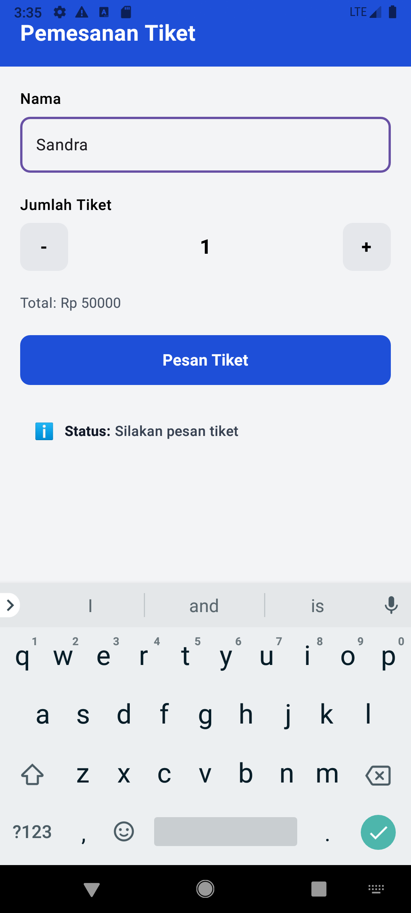
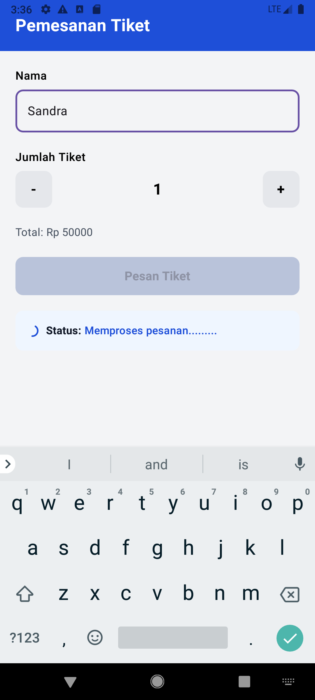
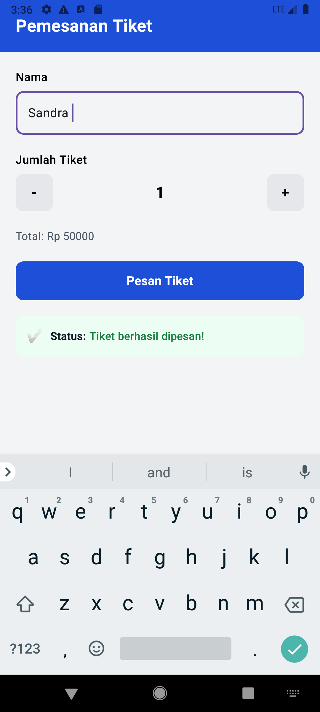
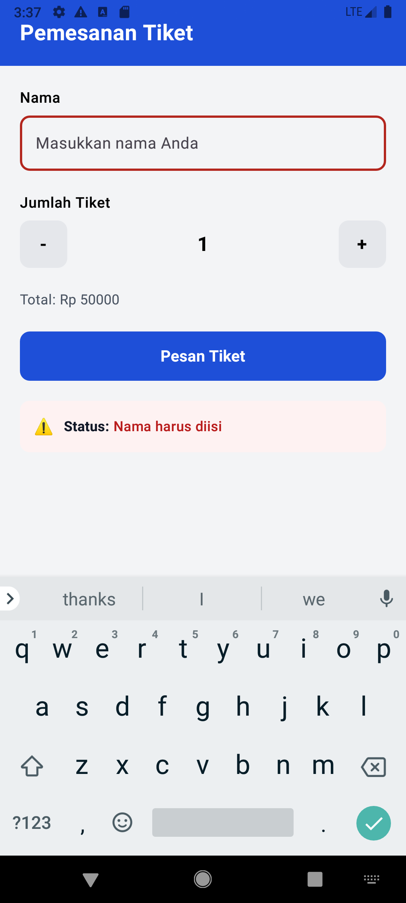

# 🎫 Pemesanan Tiket - Jetpack Compose

Aplikasi Android sederhana untuk simulasi pemesanan tiket, dibuat menggunakan **Jetpack Compose**. Proyek ini merupakan implementasi praktikum konsep **State Hoisting**, **rememberSaveable**, dan **Side-effect (LaunchedEffect)** pada Jetpack Compose.

## 📁 Isi Repository

Repository ini berisi 3 bagian utama

| Bagian | Lokasi |
|---|---|
| 📄 PDF Modul Praktikum | [`/modul/Modul_4.pdf`](modul/Modul_4.pdf) |
| 💻 Project (Source Code) | [`/app`](app) |
| 🖼️ Screenshot Hasil | [`/screensho0ts`](screensho0ts) |

## 📱 Tampilan Aplikasi

| Halaman Awal | Memproses Pesanan | Pesanan Berhasil | Validasi Nama Kosong |
|:---:|:---:|:---:|:---:|
|  |  |  |  |

## ✨ Fitur

- Input nama pembeli tiket
- Pemilihan jumlah tiket dengan tombol tambah (+) dan kurang (−)
- Perhitungan total harga otomatis (harga tiket × jumlah tiket)
- Validasi: menampilkan status **"Nama harus diisi"** jika nama kosong saat tombol "Pesan Tiket" diklik
- Simulasi proses pemesanan selama beberapa detik dengan indikator loading
- Status pemesanan berubah otomatis: **Idle → Processing → Success**
- State tetap tersimpan saat terjadi perubahan konfigurasi (rotasi layar)

## 🧠 Konsep yang Diterapkan

### 1. State Hoisting
Semua state utama (`namaPembeli`, `jumlahTiket`, `hargaTiket`, `statusType`) dikelola di composable induk `PemesananTiketScreen`. Composable anak seperti `NamaInputField`, `JumlahTiketSelector`, `PesanTiketButton`, dan `StatusCard` bersifat **stateless** — hanya menerima value dan callback (lambda) dari parent, sehingga lebih mudah digunakan ulang (reusable) dan diuji (testable).

### 2. rememberSaveable
Digunakan pada seluruh state utama agar nilainya tetap bertahan meskipun terjadi perubahan konfigurasi seperti rotasi layar, karena `remember` biasa akan hilang saat Activity dibuat ulang.

### 3. LaunchedEffect (Side-effect)
`LaunchedEffect(orderTrigger)` digunakan untuk menjalankan proses asynchronous (simulasi pemesanan) yang terikat pada siklus hidup composable. Setiap kali tombol "Pesan Tiket" diklik dengan nama yang valid, nilai `orderTrigger` bertambah, memicu efek berjalan ulang:
1. Status berubah menjadi **"Memproses pesanan........."**
2. Menunggu selama beberapa detik (`delay(...)`)
3. Status berubah menjadi **"Tiket berhasil dipesan!"**

